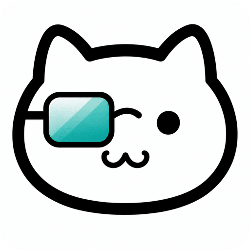

# 喵喵面试助手

面试时把提问转成文字，再结合简历给出回答要点。支持 macOS 与 Windows。

**本项目仅供学习使用，禁止商业使用。**

官网：https://interviewcheat.cn

[下载安装包](https://github.com/Emiyaaaaa/meow-interview-cheatsheet/releases/latest)

## 功能

- 采集系统音频或麦克风，实时转写面试官的话。
- 上传简历、选择岗位方向，生成可对着说的回答。
- 规避屏幕共享检测。
- 可改应用名称，面试更隐蔽。

## 技术栈

Electron / React / HeroUI / FunASR

## License

本项目仅供学习使用，禁止商业使用。详见 [LICENSE](LICENSE)。
